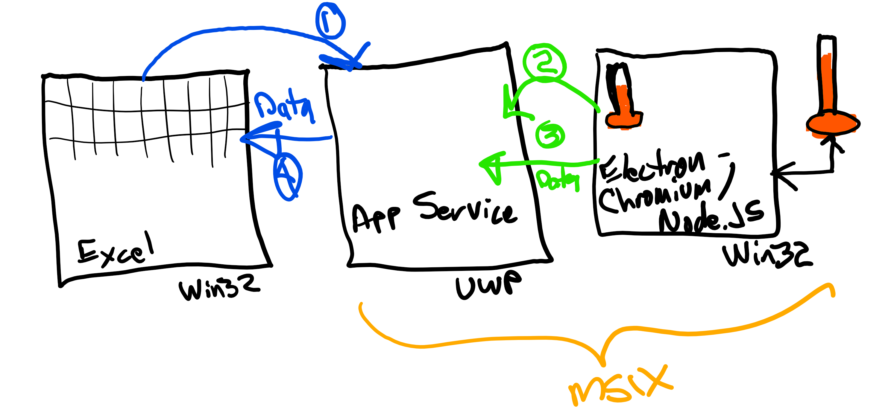
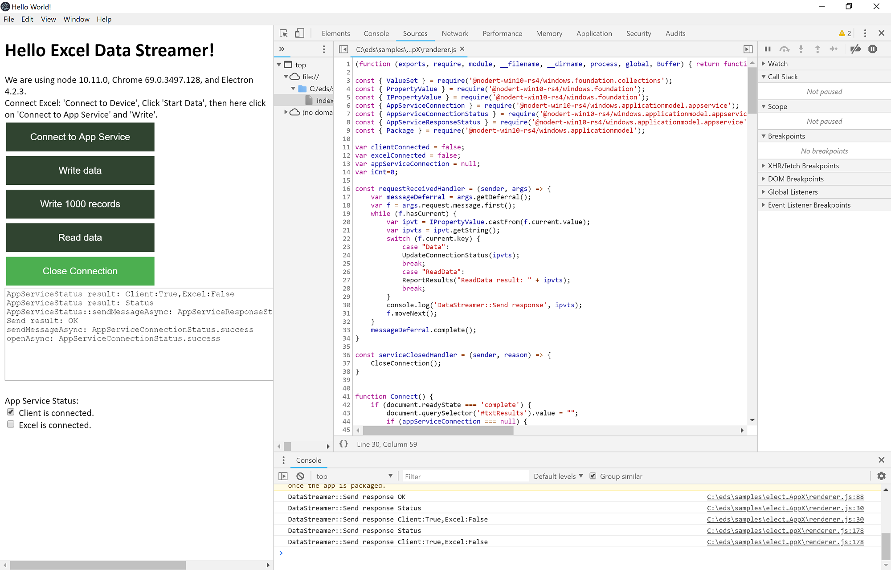
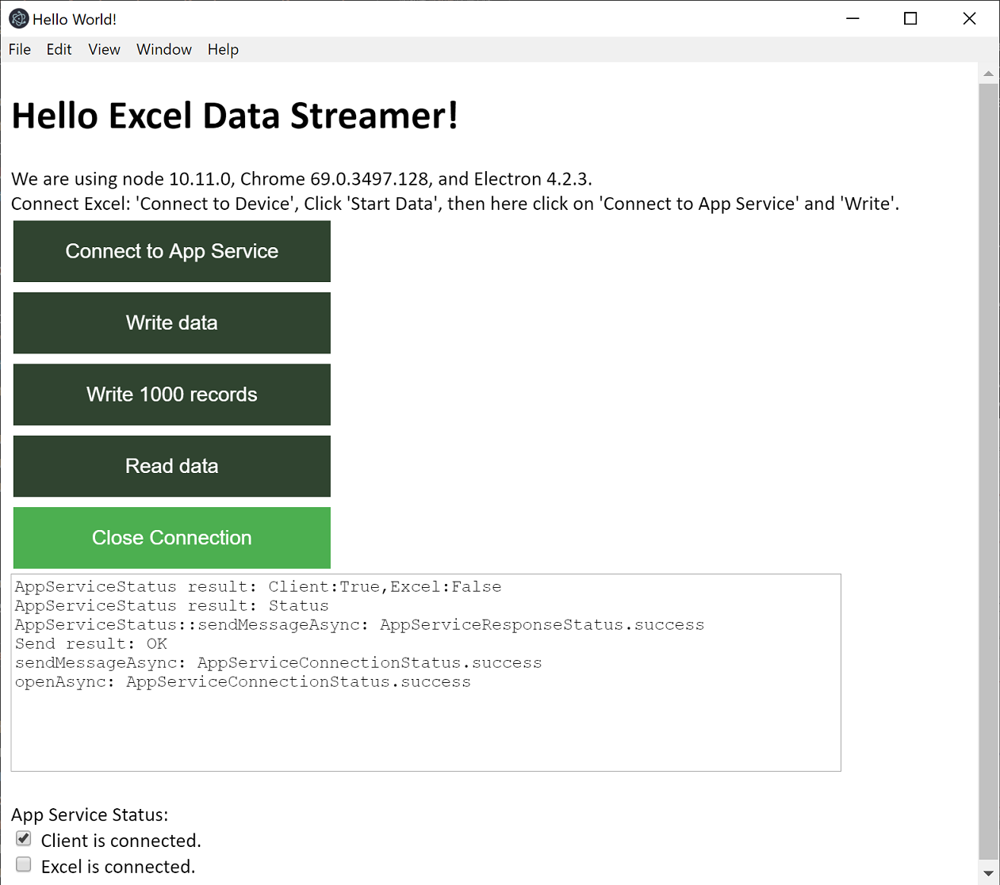
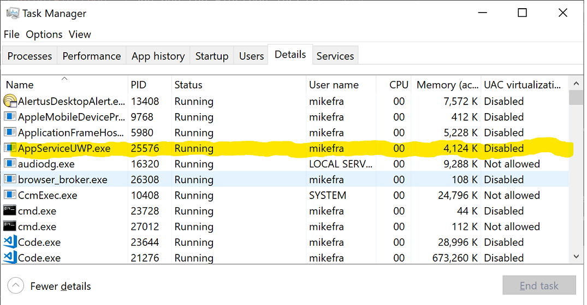
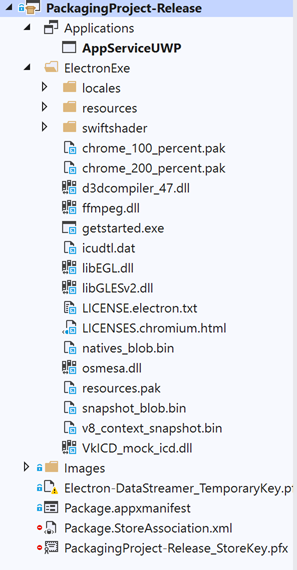
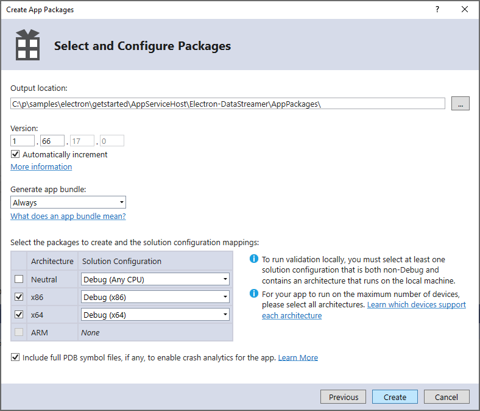

# Electron App - Excel Data Streamer Sample

 Excel’s Data Streamer  [Excel Data Streamer](https://support.office.com/en-us/article/What-is-Data-Streamer-1d52ffce-261c-4d7b-8017-89e8ee2b806f) add-in supports capturing, visualizing, and analyzing real-time sensor data in Excel.   

The Excel Data Streamer does this using the [App Service](https://docs.microsoft.com/en-us/windows/uwp/launch-resume/app-services) feature of Windows 10. App Services are a lightweight inter-app communication mechanism for Windows Applications (Win32 and UWP). 

This sample demonstrates how you can connect your Electron app with the Excel Data Streamer.

This sample will use several features of the Windows 10 platform including:  
* App Service  
* The bundling of a Win32 app (Electron app) and UWP app (App Service) in the same MSIX package.  
* Extended Capabilities:  
  * runFullTrust  
  * extendedBackgroundTaskTime

This sample will use several Electron / Node.JS  features including:
* Calling native Windows Runtime APIs from JavaScript using [NodeRT](https://github.com/NodeRT/NodeRT).  
* Conversion of an Electron app into a standalone Win32 app using [electron-builder](https://www.electron.build/).

# TL;DR - Quick Start

1. Install Office Apps from http://office.com  (Requires Office365 subscription.)
1. Open a Windows admin command prompt (cmd)  
3. Load this link into your browser: https://raw.githubusercontent.com/mjfusa/Samples/master/electron/getstarted/starthere.cmd
4. Copy and paste the contents into the admin command prompt. This script will install, configure and build the Electron components of the sample.  
5. Install Visual Studio 2019 Community with workloads:  
   a. ```.NET desktop development```  
   b. ```Desktop development with C++```  
   c. ```Universal Windows Platform Development```
6. Load **AppServiceHost.sln**  into Visual Studio  
7. Set Solution Configuration to ```Debug```, ```x86```, ```PackagingProject-Debug```  
8. Set ```PackagingProject-Debug```  as **StartUp** project.
9. Right click ```PackagingProject-Debug```  select **Deploy**.
10. From Start menu select ```Electron Datastreamer - Debug```.
11. The Electron Data Streamer client will open and connect to the App Service running in the background. **Hello Excel Data Streamer!**
12. Start Excel, Click **Data Streamer** tab
13. Click **Connect a Device**
14. Select ```Electron Datastreamer - Debug```
15. Click **Start Data**
16. Switch to the ```Electron Data Streamer``` client
17. Click **Write Data**  
18. Switch back to Excel
19. Note: Excel is populated with a single record sent from the Electron client.

# Architecture



The Excel Data Streamer uses the Windows 10 App Service infrastructure to send and receive data from a data source. Excel enumerates all app services with the name ```com.microsoft.datastreamerconnect```. This is how the **'Connect to a device'** list is built in the Data Streamer.  

The data source exposes an app service to which Excel connects. (Step 1)  
The data source, in this case the Win32 Electron app, also connects to the app service. (Step 2)  
The data source then sends data to the App Service. (Step 3)  
The App Service then relays the data to the Data Streamer via the connection saved in Step 1. (Step 4)  
The App Service (UWP) and Data Source (Win32 Electron app) are packaged and deployed in the same MSIX package.

# What's in the Sample
The sample can be broken into three parts:
1. Main UI. This is the Electron app. This is built using the npm CLI commands. The resulting Win32 app output is referenced via links in the ```PackagingProject-Release``` packaging project. 

2. Windows App Service. This is a UWP standalone EXE. The user does not interact with this and it does not appear in the Start Menu. This is the 'middle-man' that relays data from the source to the Excel Data Streamer.
3. App Package. The Electron app and App Service are both packaged in the same MSIX package.

You will need the latest version of Office 365 installed to use the Data Streamer supported by this sample. Version 1904 or greater.

# Setup
## Environment 
* Windows 10 17134 or greater
* Chocolatey package installer
* node.js npm - Node Package Manager
* Python 2.7.16
* Visual Studio 2015 Build Tools
* Visual Studio 2019 Community Edition
* Electron framework cli
* Electron Builder cli
* NodeRT libraries

## Install Tools
* Clone this repo and run ```starthere.cmd``` from a Windows admin command prompt. This will install all of the tools and build the native NodeRT libraries and Electron Win32 app.
* Note for details on the installed tools, see the batch file ```installtools.cmd```.
* Install Visual Studio Community. This is not done by the batch file. You can install from http://visualstudio.microsoft.com or use the Chocolatey command:  

```choco install visualstudio2019community --package-parameters "--add Microsoft.VisualStudio.Workload.ManagedDesktop --add Microsoft.VisualStudio.Workload.NativeDesktop --add Microsoft.VisualStudio.Workload.NetCoreTools --add Microsoft.VisualStudio.Workload.Universal  --includeRecommended --includeOptional --passive --locale en-US" -y```  

## Install Electron and build the NodeRT libraries
Note: This is done as part of the ```installtools.cmd``` batch file. See 'Install Tools' above. Included here in case you want to do this separately.

1. Start in directory: samples\electron\getstarted\Electron  

2. ```npm install --save-dev electron```  

Note: The NodeRT native Windows libraries will build using the VC build tools.  
Reference: https://github.com/electron/electron/blob/master/docs/tutorial/first-app.md  

## Install Electron-Builder to create Win32 app
Note: This is done as part of the ```installtools.cmd``` batch file. See 'Install Tools' above. Included here in case you want to do this separately.

1. Start in directory: samples\electron\getstarted\Electron  

2. ```npm install electron-builder```   
Reference: https://www.electron.build/cli  

## Run Electron-Builder to Build the Electron app targeting Windows
Note: This is done as part of the ```installtools.cmd``` batch file. See 'Install Tools' above. Included here in case you want to do this separately.

1. Start in directory: samples\electron\getstarted\Electron  
2. ```.\node_modules\\.bin\electron-builder -w```

# Sample Components 
## Open and build the AppServiceHost.sln solution in Visual Studio 2019
This solution contains four projects:  
1. **AppServiceHost** - UWP App Service
2. **ElectronLauncher** - This launches the Electron runtime with access to it's menu including developer tools. This is used in the **Packaging Project-Debug** below.
3. **Packaging Project-Debug** - Packaging Project that contains App Service, Electron App and Manifest. The apps appearance and exposing of the app service is defined here. This runs Electron in debug mode and also allows for the debugging of the app service. 
4. **Packaging Project-Release** - Packaging Project that contains App Service, Electron App and Manifest. The apps appearance and exposing of the app service is defined here. This runs the Win32 version of the Electron app.   

# Run the Packaging Project-Debug project 
This project should not be run from Visual Studio as we will use the Electron runtime to debug the JavaScript. 'Debug' in this case refers to debugging the Electron JavaScript. Visual Studio is used to build and deploy the app. We will run it from the Start menu.

 Because this project uses a ```Windows Application Packaging Project```, the runtime runs as a packaged app with a unique [identity and Package Family Name](https://docs.microsoft.com/en-us/windows/uwp/publish/view-app-identity-details). This is important in how the App Service works. The App Service (```AppServiceUwp```) assumes that if an app connecting to it does not have an identity, (Excel is a Win32 app without an identity) - that Excel is connecting. Otherwise it assumes the connection is coming from a client with an identity. Because we are running from a packaged environment, the Electron app connection to the app service will have an identity.  

 Included in the project are:  
 * The Electron runtime and dependencies (node_modules).  
 * **ElectronLauncher.exe**  this full trust Win32 app that launches the Electron runtime with the following flags:  
 ```electron.exe --inspect=5858 .\*```
 * **AppServiceUWP.exe** this is the UWP app service deployed along with the Electron runtime and Election launcher.
 
 This project runs the Electron runtime directly against the .js and .html files. This allows you to use the ```Developer Tools``` in the  Electron environment to debug your JavaScript.  
   


1. You will need to build the Electron components prior to debugging the sample. If you installed the tools via the batch file  (see ```Install tools``` above), you have already done this. If not, navigate to ```samples\electron\getstarted\Electron``` and run the Electron install command:  
   ```npm install```
2. Start Visual Studio and open the **AppServiceHost** solution. 
3. The Build targets should be for x86, Debug. The StartUp project should be **Packaging Project-Debug**. Right click the **Packaging Project-Debug** project and select **Deploy**. This will deploy the app and register the App Service.
4. From the Windows Start menu, select ```Windows Datastreamer - Debug```. It may take a minute to Start. The Electron client will connect to the ```UWPAppService``` in the background. The Client app will look like this:
 The dark green buttons are disabled as the App Service is already connected but not yet connected to Excel.
5. Verify the ```App Service``` is running via ```Task Manager```. See 'Details` tab:


6. Connect to the Excel Data Streamer:
   a. Start Excel  
   b. Click on the ```Data Steamer``` tab  
   c. Click on **Connect to Device**  
   d. Click on **Packaging Project-Debug**  
   e. Click on **Start Data**  
   f. Switch focus to Electron App  
   g. Click on **Write Data**  
   h. Switch focus back to Excel  
   Note: Excel will be populated with the data sent from the Electron UI  
7. You can use the Developer Tools in the Electron shell to debug your JavaScript and step through the calls to the App Service.

## Debug the App Service
1. From the Windows Start menu, select ```Windows Datastreamer - Debug``` to start the Electron data source UI.
1. In Visual Studio, open ```App.xaml.cs``` from ```samples\electron\getstarted\AppServiceHost\AppServiceUWP```  
2. Navigate to the ```OnBackgroundActivated```  
3. Set a breakpoint on 
```C# 
base.OnBackgroundActivated();
```  
4. Do NOT press F5 or start debugging.
5. Attach to the running ```AppServiceUWP.exe```  
   a. Debug | Attach to Process  
   b. Select ```AppServiceUWP.exe```  
6. Connect to the Excel Data Streamer:   
   a. Start Excel  
   b. Click on the ```Data Steamer``` tab  
   c. Click on **Connect to Device**  
   d. Click on **Packaging Project-Debug**  
7. Switch back to ```Visual Studio``` and note the breakpoint is hit. Press F5 to allow the App Service to continue.  

## Run the sample (Release)
Note that this requires that the Electron app has been built with Electron-Builder. See the above section, ```Run Electron-Builder to Build the Electron app targeting Windows```.
1. Press F5 to build and run the sample. The Build targets should be for x86, Release. The StartUp project should be **Packaging Project-Release**. This will deploy the app and register the App Service.
2. Connect to the Excel Data Streamer:  
   a. Click on the ```Data Steamer``` tab  
   b. Click on **Connect to Device**  
   c. Click on **Packaging Project-Debug**  
   d. Click on **Start Data**  
   e. Switch focus to Electron App  
   f. Click on **Write Data**  
   g. Switch focus back to Excel  
   Note: Excel will be populated with the data sent from the Electron UI  

# Package the app for testing and submission to the Microsoft Store  

## App Packaging

Using a 'Windows App Packaging Project' we package the App Service and the Electron app together. It includes the necessary edits to Package.appxmanifest to support the app service registration and launching of the electron client. You can create packages for sideloading or uploading to the Store.

Is is what the ```<Applications>``` section looks like:

```xml
  <Applications>
    <Application Id="App"
      Executable="AppServiceUWP.exe"
      EntryPoint="App">
      <uap:VisualElements
        AppListEntry="none"
        DisplayName="Electron Data Streamer - Release"
        Description="Electron- Data Streamer Client"
        BackgroundColor="transparent"
        Square150x150Logo="Images\Square150x150Logo.png"
        Square44x44Logo="Images\Square44x44Logo.png">
        <uap:DefaultTile Wide310x150Logo="Images\Wide310x150Logo.png"  Square71x71Logo="Images\SmallTile.png" Square310x310Logo="Images\LargeTile.png"/>
        <uap:SplashScreen Image="Images\SplashScreen.png" />
      </uap:VisualElements>
      <Extensions>
        <uap:Extension Category="windows.appService">
          <uap:AppService Name="com.microsoft.datastreamerconnect"/>
        </uap:Extension>
      </Extensions>
    </Application>
    <Application Id="FTApp"
      Executable="ElectronExe\getstarted.exe"
      EntryPoint="Windows.FullTrustApplication">
      <uap:VisualElements
        DisplayName="Electron Data Streamer - Release"
        Description="Electron- Data Streamer Client"
        BackgroundColor="transparent"
        Square150x150Logo="Images\Square150x150Logo.png"
        Square44x44Logo="Images\Square44x44Logo.png">
        <uap:DefaultTile Wide310x150Logo="Images\Wide310x150Logo.png"  Square71x71Logo="Images\SmallTile.png" Square310x310Logo="Images\LargeTile.png"/>
        <uap:SplashScreen Image="Images\SplashScreen.png" />
      </uap:VisualElements>
    </Application>
```
Note there are two applications listed here. The first is our App Service (AppServiceUWP.exe). The second is our Electron app (ElectronExe\getstarted.exe). 

 Note the line
```xml
AppListEntry="none"
```
This will prevent the App Service from being added the the **Start** menu. Having the app in the Start menu is not needed since the app service is never started by the user.

## Including the Electron App
The electron app is included in the Packaging Project via linked files to the output files of ``Electron-Builder``. Electron-Builder writes it's output to the folder: ```dist\win-unpacked```. In Visual Studio, I created the folder ```ElectronExe``` and copied the files (and subfolders) from  ```dist\win-unpacked``` to this folder as **links**. Links are important, it allows the files to change and update as subsequent builds are done.  



## Package.appxmanifest file:

You will need to include the following Restricted Capabilities in the Package.appxmanifest file:

```xml
xmlns:rescap=http://schemas.microsoft.com/appx/manifest/foundation/windows10/restrictedcapabilities
. . . 
IgnorableNamespaces="uap mp rescap build">

  <Capabilities>
. . . 
    <rescap:Capability Name="runFullTrust" />
    <rescap:Capability Name="extendedBackgroundTaskTime" />
  </Capabilities>
```

You will need to edit the XML directly: Highlight the file in Solution explorer,  press F7 to edit the file directly.

## App Submission
As these capabilities are restricted, you will need to provide justification in your application’s submission in Partner Center:

Note: No justification is required for the runFullTrust capability.

In the ‘Submission Options’, in answer to the following question:  
**Why do you need the extendedBackgroundTaskTime capability, and how will it be used in your product?**

You can use the following text:  
```This restricted capability (extendedBackgroundTaskTime) is needed due to the architecture of the Excel Data Streamer and how it interfaces with our UWP app service. Because Excel is a Win32 app, app services that it connects to are given only 30 seconds to run. The workaround for this scenario is to include the extendedBackgroundTaskTime capability in the app manifest. This removes to 30 second run-time restriction allowing our solution to run as expected.```

## Package the app for Sideloading

Sideloading refers to installing an app directly from its package (APPX or MSIX) as opposed to installing from the Microsoft Store. This way you can provide the package to testers and others for testing and feedback purposes.  

Create sideload packages in Visual Studio:  
1. Right click the **Packaging Project-Release** project.
2. Select Store | Create App Packages | I want to create packages for sideloading.
3.  Check only **x86** and **x64** architectures.  Suggested defaults below:
    
4. Click ``Create``. 

Note: If installed on Windows 10 Pro or Home, these SKUs of Windows have the Sideloading setting enabled. (This is required if installing apps outside of the Store.) If installed on Windows 10 Enterprise, the device must have Sideloading enabled. (It’s disabled by default.)  Details [here](https://docs.microsoft.com/en-us/windows/application-management/sideload-apps-in-windows-10).

You can sideload the app by first installing the test certificate, following these steps:
1. Right-click on the .appxbundle or .appx package and select **properties**.
2. Under the **Digital Signatures** tab you should see the test certificate. Click to select the certificate and click on Details button.
3. Select the button **View Certificate**.
4. Select the button **Install Certificate**.
5. From the **Store Location** radio buttons select **Local Machine**. Click the **Next** button.
6. Click **Yes** on the admin prompt for changes to your device.
7. On the **Certificate Import Wizard** chose the radio button **Place all certificates in the following store** then select the **Browse** button.
8. Select the **Trusted People** certificate store. Then click the **OK** button.
9. Click the **Next** button on the **Certificate Import Wizard** window.
10. Click **Finish** button to complete the certificate install.
    
 After installing the certificate, you can double click on the the .appx/.msix or .appxbundle/.msixbundle to launch [App Installer](https://www.microsoft.com/store/apps/9nblggh4nns1) and install the app.  

 ## Package the app for Publishing to the Microsoft Store  

1. Change the Build targets to Release
2. Right click the ```Packaging Project-Release``` project.  
3. Select Store | Associate app with the Store  
4. Select you app name or reserve a new name
5. Accept defaults. Your app is now has the identity as assign by the Store    
6. Right click the ```Packaging Project-Release``` project.  
7. Select Store | Create App Packages | Microsoft Store  
8. Check only x86 and x64 architectures. See suggested defaults in sideloading section above.
9. Click ``Create``. 
10. Use the resulting package (.appxupload or .msixupload) to publish your app or games to the Microsoft Store via [Partner Center](https://partner.microsoft.com). If you don't have an account, you can sign up [here](https://developer.microsoft.com/store/register).
